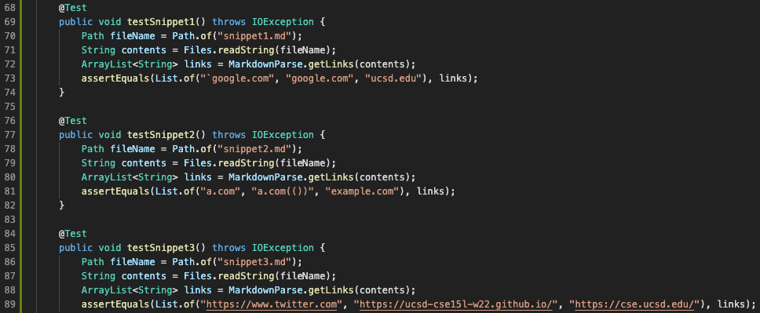

# Lab Report 4 Week 8
---
Link to my repository: [https://github.com/bho9/markdown-parse](https://github.com/bho9/markdown-parse)

Link to the other repository: [https://github.com/maotcha/markdown-parse](https://github.com/maotcha/markdown-parse)

---

## MarkdownParseTest.java Code
This is how I turned it into a test.

---

## Snippet 1
My implementation result:

Other implementation result:

---

## Snippet 2
My implementation result:

Other implementation result:

---

## Snippet 3
My implementation result:

Other implementation result:

---

Q1: Do you think there is a small (<10 lines) code change that will make your program work for snippet 1 and all related cases that use inline code with backticks? If yes, describe the code change. If not, describe why it would be a more involved change.

A: I think yes, there is a small code change that would make my program work for snippet 1. I would simply add a check (like an if-statement) to check that if a backtick is found *before* an open bracket `[`, skip everything in the line until the next backtick, then continue searching for another possible open bracket in the line.

---

Q2: Do you think there is a small (<10 lines) code change that will make your program work for snippet 2 and all related cases that nest parentheses, brackets, and escaped brackets? If yes, describe the code change. If not, describe why it would be a more involved change.

A: I don't think a small code change will make my program work for snippet 2. With multiple brackets or parentheses, especially nested ones, it can be hard to determine which link should be valid or not, or which bracket/parentheses to skip/ignore; the conditions to skip or include.

---

Q3: Do you think there is a small (<10 lines) code change that will make your program work for snippet 3 and all related cases that have newlines in brackets and parentheses? If yes, describe the code change. If not, describe why it would be a more involved change.

A: I think a small code change is possible to make my program work for snippet 3. Simply just use a method (something like `trim()`) or two to "remove" the spaces or newlines if and only if they're in between brackets and parentheses. For the case where there is no closing parenthesis, just add a skip or ignore until the next open bracket.