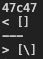
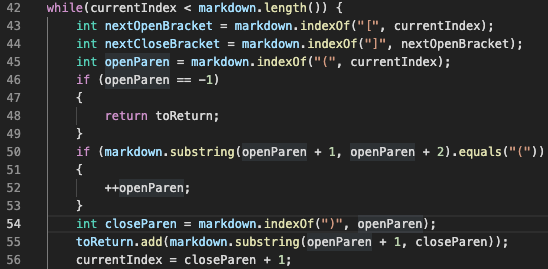
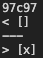

# Lab Report 5 Week 10
---
## Two tests where I had different answers:

1. [12.md](testfilesforreport5/12.md)

2. [142.md](testfilesforreport5/142.md)

---

I used the terminal command
```
diff lab9/markdown-parse/results.txt markdown-parse/results.txt
```
to find the tests with different results. The left is the other `markdown-parse` while the one on the right is mine. The terminal shows which line numbers are different, and since I also outputted the name of file that the result is associated with in `results.txt`, I was able to find the correct test file.

---

## Test for 12.md

The class implementation of `markdown-parse` produces the expected output, while my implementation does not.

Actual outputs (bottom is my output):



Expected output:

```
[]
```

The reason why my implementation is not correct is because I skipped checking for open and close brackets `[]` before parentheses `()`. Therefore, in this file, the program sees a `\` inside of parentheses (like this: `(\)`) and assumes that it is a valid link. The part that should be fixed 
is lines 46-53 in this image.



---

## Test for 142.md

The class implementation of `markdown-parse` produces the expected output, while my implementation does not.

Actual outputs (bottom is my output):



Expected output:

```
[]
```

The reasons why my implementation is not correct is because I did not add code skipping/ignoring code blocks. This file has everything inside a code block yet my implementation does not consider code blocks as not containing potential links. The other reason is the same as the previous reason; it skips checking for open and close brackets `[]` before parentheses `()`. The program sees an `x` inside parentheses (like this: `(x)`), and thus, assumes that it is a link. To fix this, I could add code block checks after line 44, and, as before, fix lines 46-53 in this image.

